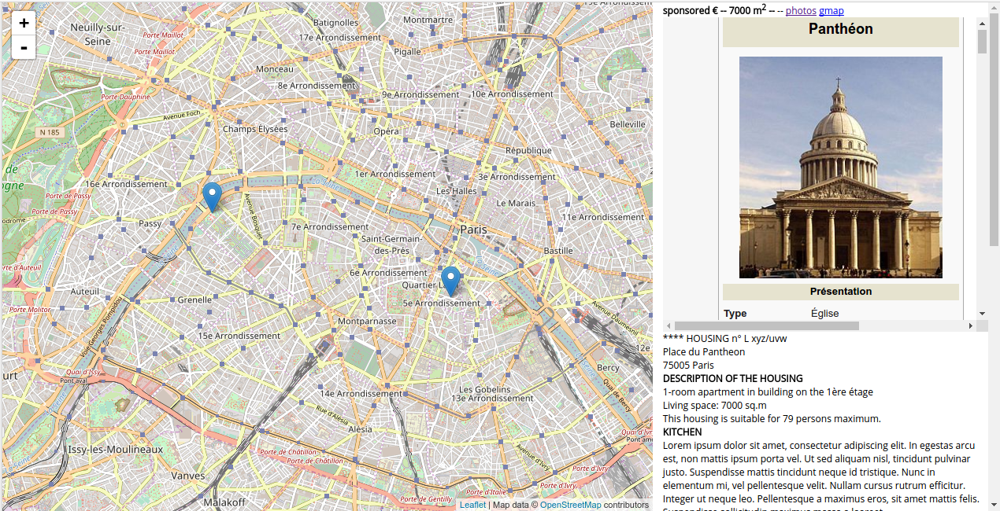

# Email to interactive map

When I came to Paris as scientist, I asked support to the wonderful agency [Science Accueil](http://www.science-accueil.org).
Their services are truly great and I easily got set-up in France.

However, reading their list of available flats was a nightmare, as  the list is truly a `textual list`.

This notebook converts the list in an [interactive map](example.html), with the description of each marker showing up when the mouse is over it.

## Python's automagic

The flats list looks like this ( or this [data/list_example.dat](data/list_example.dat) ):

>    **** HOUSING n° L xyz/uvw
>
>   Place du Pantheon
>   75005 Paris
>
>   DESCRIPTION OF THE HOUSING
>
>   1-room apartment in building on the 1ère étage
>
>   Living space: 7000 sq.m
>
>   This housing is suitable for 79 persons maximum.
>
>   KITCHEN
>
>   Lorem ipsum dolor  ..
>
>   BATHROOM(S)
>
>   Mauris maximus turpis ..
>
>   ...

If you do not know Paris (and I didn't), it is clearly difficult to understand the position and features of each flat,
unless you make yourself a `map`.

Making a map of the flats and descriptions is so *booooring*.. let's make it automatic and fast!

The following code makes the map for you (jump at the end to see an example) in 5 simple steps
1. Parse the informations (as received, just copy and paste from the email)
2. Geolocate the flats (googlemaps library)
3. Extract informations from house description
4. Optimize informations for visualization
5. Visualize as an interactive map with HTML+JS (and save)

*NOTA BENE* in the GitHub repo I use an `example.dat` flats description file stripped of any real flat information.
It contains only two fictious flats: one in Tour Eiffel, and another in the Pantheon.
